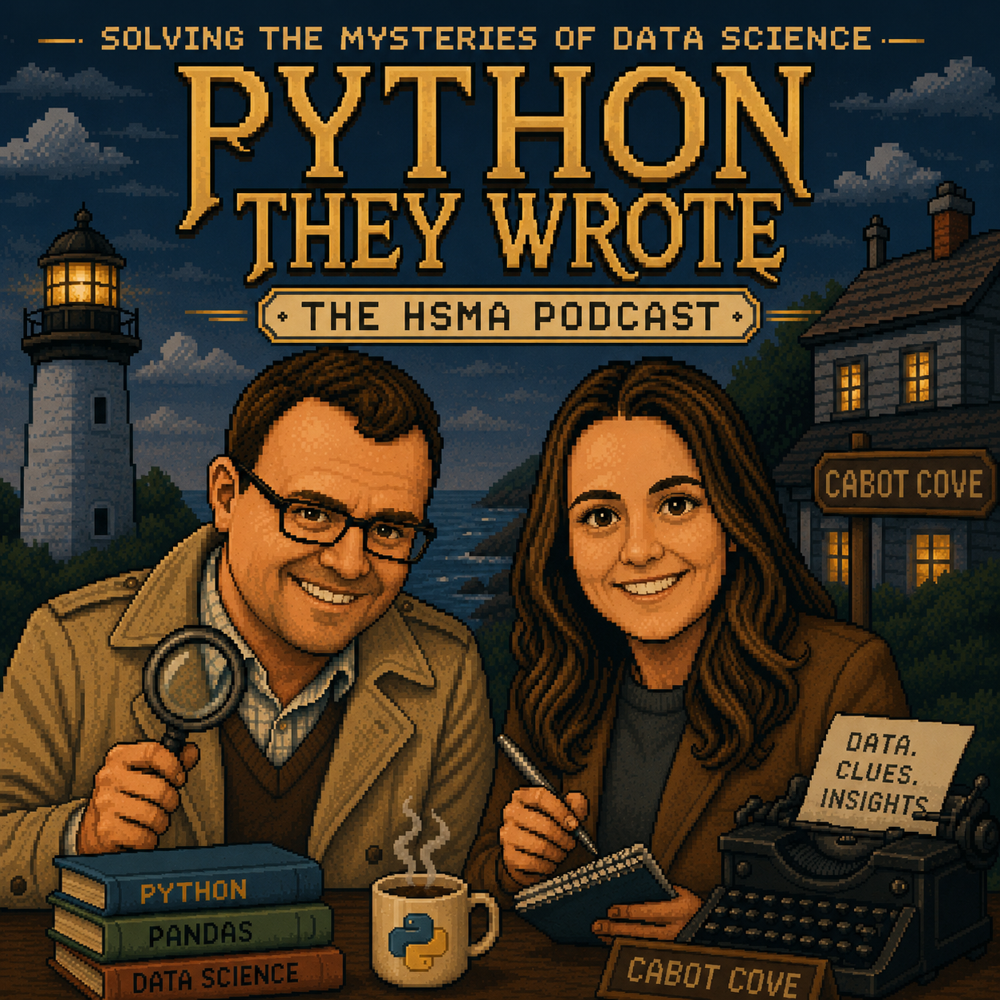

<style>
body {
  text-align: center;
}

.quarto-listing {
    justify-content: center;
    justify-items: center;
}

.columns {
    display: flex;
    align-items: center;
}

/* Left align text column */
.left-text {
    text-align: left;
}

/* Right align image column */
.right-image {
    text-align: right;
}

</style>

:::: {.columns .fade-in .delay-1}

::: {.column width='47.5%' .right-image}

{height=400}

:::

::: {.column width='5%'}

:::

::: {.column width='47.5%' .left-text}
## Solving the Mysteries of Healthcare Data Science and Modelling

Welcome to the home of 'Python She Wrote' - the podcast of the Health Service Modelling Associates (HSMA) programme.

Join us as we put on our sleuthing hats and interview the people who can help us unravel the mystery of how to better use data to change lives - one fascinating story at a time.
:::

::::




```{=html}
<!-- First value grid box with scroll-trigger class -->
<div class="value-grid-box-2 scroll-fade-in" style="justify-content:center; text-align:center;">
  <a href="[https://podcast.hsma.co.uk/episodes](https://podcast.hsma.co.uk/episodes)" class="value-box bg-red">
    <div class="icon" style="font-size: 2rem;"><i class="bi bi-headphones"></i></div>
    <div class="details">Click here to listen to our past episodes</div>
  </a>
  <a href="[https://hsma.co.uk](https://hsma.co.uk)" class="value-box bg-red">
    <div class="icon" style="font-size: 2rem;"><i class="fa-solid fa-chalkboard-user"></i></div>
    <div class="details">Click here to find out more about the HSMA programme</div>
  </a>
</div>

<!-- Second value grid box with scroll-trigger class -->
<div class="value-grid-box-2 scroll-fade-in" style="justify-content:center; text-align:center;">
  <a href="[https://hsma.co.uk/hsma_content/modules/modules.html](https://hsma.co.uk/hsma_content/modules/modules.html)" class="value-box bg-red">
    <div class="icon" style="font-size: 2rem;"><i class="bi bi-camera-reels"></i></div>
    <div class="details">Click here to access our HSMA 6 content recordings, slides and sample code</div>
  </a>
  <a href="[https://hsma.co.uk/hsma_content/books/books.html](https://hsma.co.uk/hsma_content/books/books.html)" class="value-box bg-red">
    <div class="icon" style="font-size: 2rem;"><i class="bi bi-book"></i></div>
    <div class="details">Click here to view our teach-yourself ebooks on Python, geographic modelling, simulation (and more)</div>
  </a>
</div>

<script>
document.addEventListener("DOMContentLoaded", function() {
  // Set up the intersection observer
  const observer = new IntersectionObserver((entries) => {
    entries.forEach(entry => {
      // Check if the element has scrolled into view
      if (entry.isIntersecting) {
        entry.target.classList.add('visible');
        observer.unobserve(entry.target); // Stops watching once animated
      }
    });
  }, {
    threshold: 0.1 // Triggers when 10% of the element becomes visible on screen
  });

  // Target all elements with the scroll-fade-in class
  document.querySelectorAll('.scroll-fade-in').forEach(element => {
    observer.observe(element);
  });
});
</script>
```
